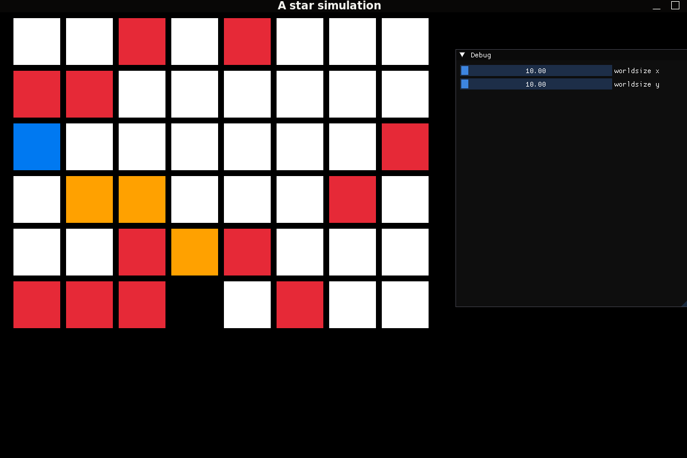

# A* Pathfinding in C++ with Raylib

This repository contains an implementation of the A* (A-star) pathfinding algorithm in C++ using the Raylib library. A* is a widely used and efficient pathfinding and graph traversal algorithm, commonly employed in various fields such as AI, robotics, and gaming. You can learn more about it on [Wikipedia](https://en.wikipedia.org/wiki/A*_search_algorithm).
This repository uses cmake as the build process

## Features
- **A* Pathfinding Algorithm**: Efficiently finds the shortest path between nodes in a graph.
- **Raylib Integration**: Visualizes the pathfinding process using the Raylib library.
  
## Visualization
Here is a snapshot of the pathfinding algorithm in action:


## Getting Started

### Prerequisites
- [Raylib](https://www.raylib.com/) - Make sure Raylib is installed on your system.
- Install rlImGui and IMgui also

### Installation
Clone the repository:
```bash
git clone https://github.com/your-username/your-repo.git
cd your-repo
cd builds
cmake ../
./main
